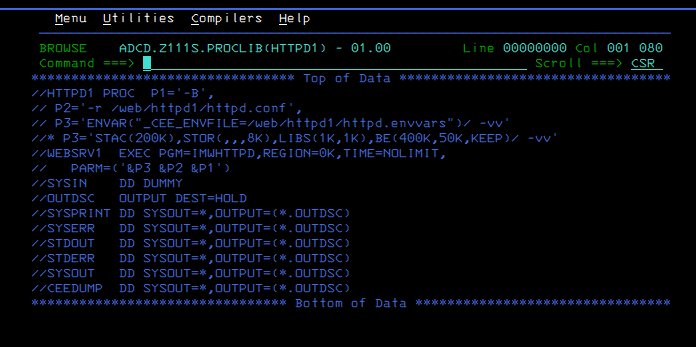
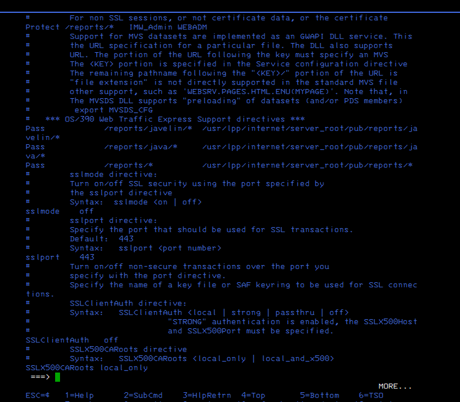
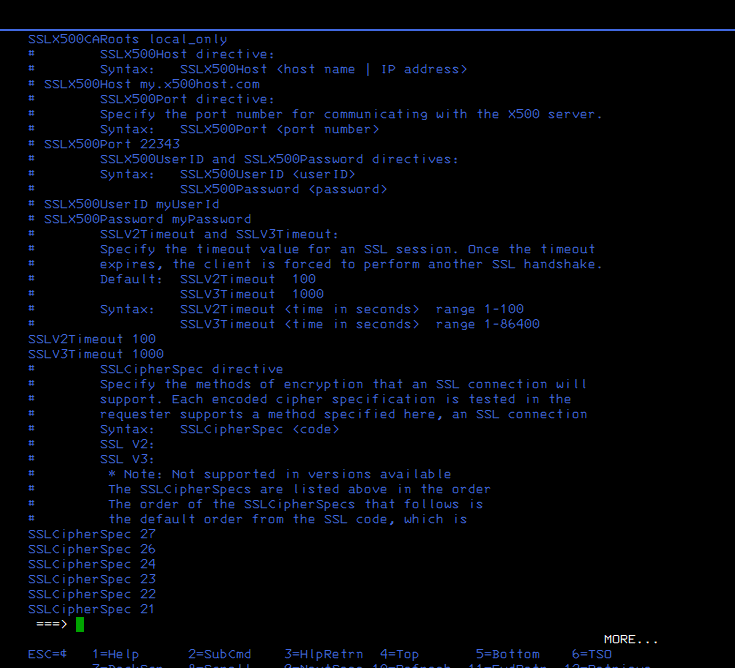
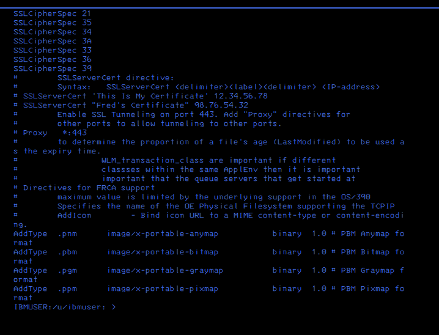
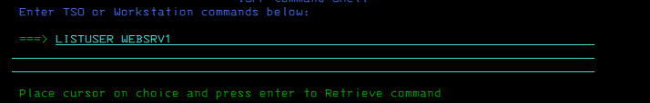
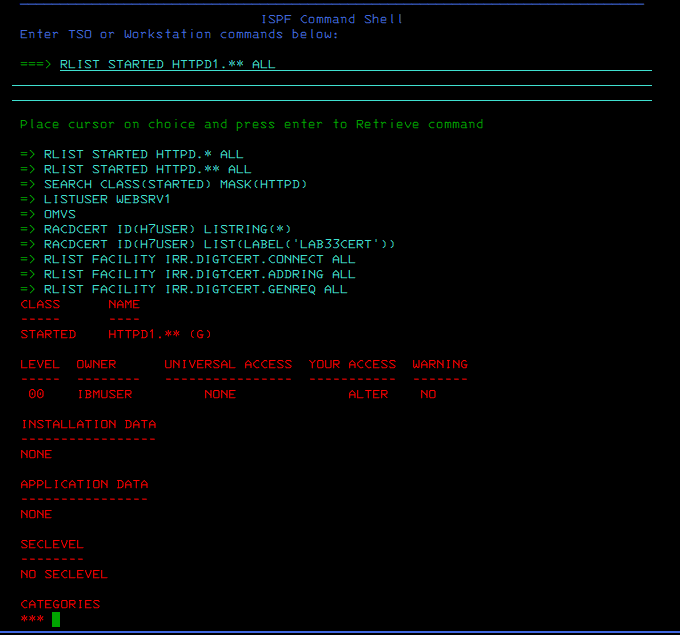
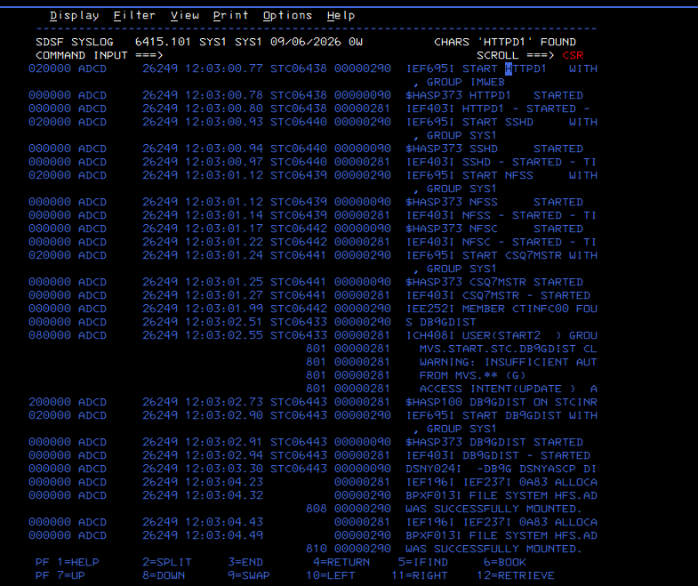
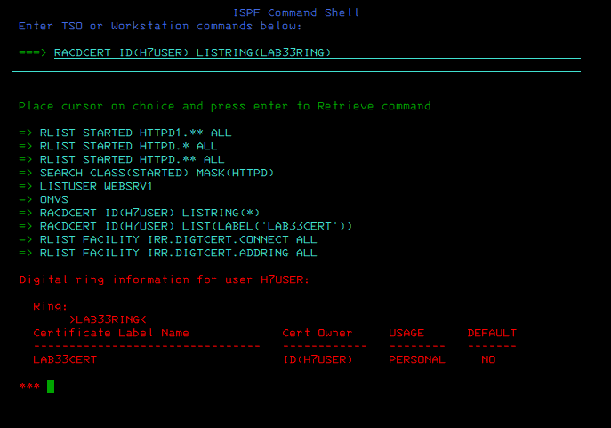

# Evidence Walkthrough — Lab 23 Part 1

[← Lab lesson](../README.md) · [Academy lab standard](https://github.com/P-dot/P-dot/blob/main/docs/LAB-STANDARD.md)

These screenshots are not a gallery. Together they support the Part 1 readiness argument: identify the HTTP implementation, inspect its SSL-capable configuration, resolve the RACF STARTED-class context, inspect startup evidence, and reconnect the network course to the retained RACF key-ring artifact.

> **Evidence boundary:** Part 1 does not prove an active AT-TLS session, successful TLS handshake, or HTTPD1 consumption of the retained key ring.

## 1. Identify the HTTP server

### Evidence 01 — HTTPD1 started procedure

**Observe:** ADCD.Z111S.PROCLIB(HTTPD1) executes PGM=IMWHTTPD and supplies /web/httpd1/httpd.conf plus /web/httpd1/httpd.envvars.

**Interpret:** the target is an existing z/OS HTTP server instance with an identifiable PROC and configuration path.

**Why it matters:** AT-TLS design must protect a real endpoint without confusing application configuration with TCP/IP transport security.

## 2. Inspect the HTTP configuration

Evidence 02–07 walk through the existing HTTP configuration. They show reporting, code-page, logging and LDAP-related directives. Their value is contextual: the learner is inspecting the actual service configuration rather than assuming a modern web-server layout.

| Evidence | What to notice | Interpretation |
|---|---|---|
| 02 | DefaultFsCp / DefaultNetCp | Explicit EBCDIC/ASCII conversion context |
| 03–06 | Access-report and reporting directives | Application reporting controls, not proof of AT-TLS observability |
| 07 | LDAP-related SSL documentation | SSL-capable syntax exists; documentation is not runtime proof |

### Evidence 08–10 — native SSL-capable directives

**Observe:** SSL-related directives include SSLMode, SSLPort, client-authentication/cipher settings and server-certificate syntax. The captured state shows SSLMode off and port 443 as the SSL port value.

**Interpret:** HTTPD1 is SSL-capable at the application layer, but native HTTP SSL is not active in the captured state.

**Why it matters:** the lab deliberately separates application-native SSL from transparent Communications Server AT-TLS.

**Boundary:** a configured port or cipher directive does not prove a listener, handshake or encrypted connection.

## 3. Resolve the security identity correctly

### Evidence 11–12 — test the WEBSRV1 assumption

**Observe:** LISTUSER WEBSRV1 returns ICH30001I UNABLE TO LOCATE USER ENTRY WEBSRV1.

**Interpret:** a runtime label must not be promoted into a claim that a RACF USER profile named WEBSRV1 exists.

**Why it matters:** effective identity must be resolved from evidence, not from a plausible-looking name.

### Evidence 13–17 — STARTED-class discovery

**Observe:** SEARCH CLASS(STARTED) MASK(HTTPD) identifies HTTPD1.**; RLIST STARTED HTTPD1.** ALL shows the generic profile and its access/audit information.

**Interpret:** HTTPD1 is covered by STARTED-class semantics and member-derived identity mapping.

**Why it matters:** certificate/key-ring access and later AT-TLS authorization depend on the actual execution/security context.

**Boundary:** STARTED profile configuration alone is not proof of the user ultimately assigned to a particular historical start.

## 4. Correlate startup evidence

### Evidence 18–22 — IEF695I search

These SDSF/SYSLOG views search historical startup messages around IEF695I.

**Observe:** many started-task assignments and initialization messages are visible, but the captured region does not establish the desired HTTPD1-to-WEBSRV1 RACF assignment.

**Interpret:** similar messages are insufficient unless service, time and identity correlate.

**Why it matters:** this demonstrates evidence discipline rather than filling a gap with an assumption.

### Evidence 23–27 — HTTPD1 startup timeline

**Observe:** the SYSLOG sequence includes IEF695I START HTTPD1, $HASP373 HTTPD1 STARTED and IEF403I HTTPD1 - STARTED among neighboring initialization activity.

**Interpret:** service startup is evidenced.

**Why it matters:** service-start proof and RACF identity-assignment proof are related but not equivalent.

**Boundary:** these screenshots do not prove TLS activation or effective key-ring access.

## 5. Reconnect to the RACF cryptographic handoff

### Evidence 28 — retained LAB33RING association

**Observe:** RACDCERT ID(H7USER) LISTRING(LAB33RING) displays LAB33RING and the retained LAB33CERT association.

**Interpret:** the cryptographic artifact produced by the RACF course remains available as the security-side handoff object.

**Why it matters:** this is the explicit bridge between [RACF cryptographic trust](https://github.com/P-dot/mainframe-racf-security-evidence) and Communications Server AT-TLS engineering.

**Boundary:** existence of the ring/certificate association does not prove that HTTPD1, Policy Agent or System SSL can consume it under the required runtime identity.

## Evidence chain

    HTTPD1 PROC identified
            |
    HTTP configuration inspected
            |
    native SSL distinguished from AT-TLS
            |
    WEBSRV1 assumption rejected
            |
    STARTED-class profile resolved
            |
    HTTPD1 startup confirmed
            |
    LAB33RING / LAB33CERT retained
            |
            v
    NEXT QUESTION:
    Which runtime identity requires which key-ring authority
    before a minimum TTLS policy can be activated safely?

## Result supported by this evidence

**PASS — readiness checkpoint.**

The evidence supports characterization of the target and its security dependencies. It does **not** support a claim of end-to-end encrypted HTTP.

---
### Continue learning

**Course:** [Communications Server](../../../README.md)  
**Security prerequisite:** [RACF / SAF](https://github.com/P-dot/mainframe-racf-security-evidence)  
**Next:** [Lab 23 Part 2](../../23-http-attls-integration-readiness-part-2/)  
**Academy:** [z/OS Engineering Academy](https://github.com/P-dot/P-dot/blob/main/docs/ACADEMY.md)
